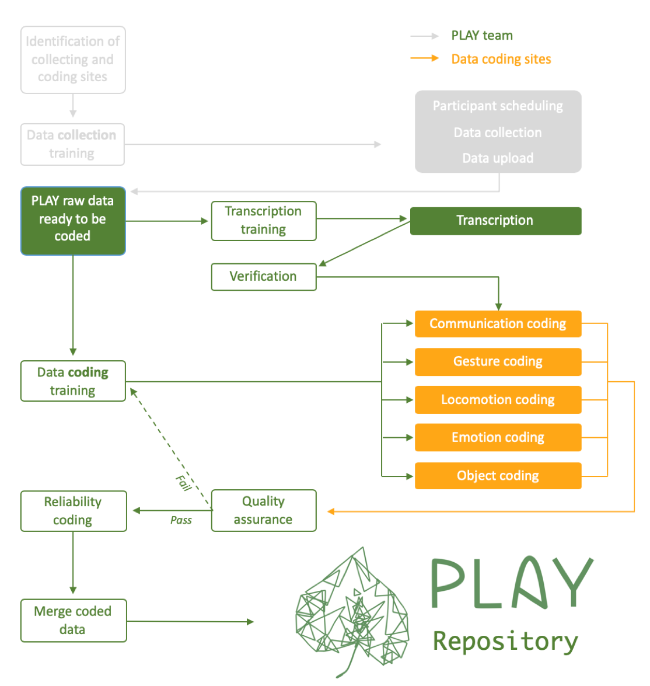

```{r setup, include=FALSE}
knitr::opts_chunk$set(echo = FALSE)
source("R/write_video_clip_html_SJ.R")
```

<br>

# Coding overview and setup

The collaborating sites in PLAY perform a variety of roles (see [people](people.html) for details). Each site that performs a **coding** role is pre-assigned to complete one or more coding functions (see in yellow below). This webpage contains detailed help for coding set up, workflow, and step-by-step procedures for each coding function. 



### Quality Assurance

All videos that are coded with go through a quality assurance process in which the PLAY team will ensure that the coded videos are eligible to be included in the final sample. Videos that pass QA will be checked for reliability, merged, and added to the final PLAY dataset. Coded videos that don't pass QA will be sent back to the coding site for recoding. In some cases, the coding site might be provided additional training.

### Getting Started

To code videos, you will need:
* access to Databrary, the video repository that will contain files to be coded
* a downloaded version of Datavyu, a video-coding application
* coding templates and scripts

1. **Download** the [development version of Datavyu](http://datavyu.org/download.html).
2. **Download** the *PLAY_CodingTemplate.opf* file from the [PLAY Databrary Volume](https://nyu.databrary.org/volume/254/slot/14924/-?asset=73892). Name this file with the PLAY naming convention (e.g., *PLAY_NYU001, … PLAY_NYU010, … PLAY_NYU030*).
    - This template contains all of the primary variables that will be coded by each site: communication, gesture, locomotion, object interaction, and emotion.
3. **Download** Ruby scripts for each coding variable as needed from the [PLAY Github repository](https://github.com/databrary/PLAY-Project-Datavyu-scripts).
4. Familiarize yourself with Datavyu before you begin coding (resources on Datavyu.org, videos from past workshops, etc.).
    - Refer to the [Datavyu User Guide](http://www.datavyu.org/user-guide/index.html).
    - Take a look at our [Best Practices for Coding Behavioral Data From Video](http://www.datavyu.org/user-guide/best-practices.html) on the Datavyu site.

### Coding in Passes

* The coding manual describes the transcription process and codes for 5 content areas: communication, gesture, locomotion, object interaction, and emotion.
* Each content area includes two passes: one pass for the infant and one pass for the mother. *For gesture alone, the child and mom are coded together in a single pass.*
* A *pass* entails scoring the relevant codes for 1-hour of video.

Please visit our [GitHub Repository](https://github.com/databrary/PLAY-Project-Datavyu-scripts) for all of the scripts mentioned in this wiki.
<br><br>

<hr class="play">

```{r child = 'coding_communication.Rmd'}
```

<hr class="play">

```{r child = 'coding_gesture.Rmd'}
```

<hr class="play">

```{r child = 'coding_locomotion_child.Rmd'}
```

```{r child = 'coding_locomotion_mom.Rmd'}
```

<hr class="play">

```{r child = 'coding_objects.Rmd'}
```

<hr class="play">

```{r child = 'coding_emotion.Rmd'}
```

<hr class="play">

```{r child = 'coding_transcription.Rmd'}
```

