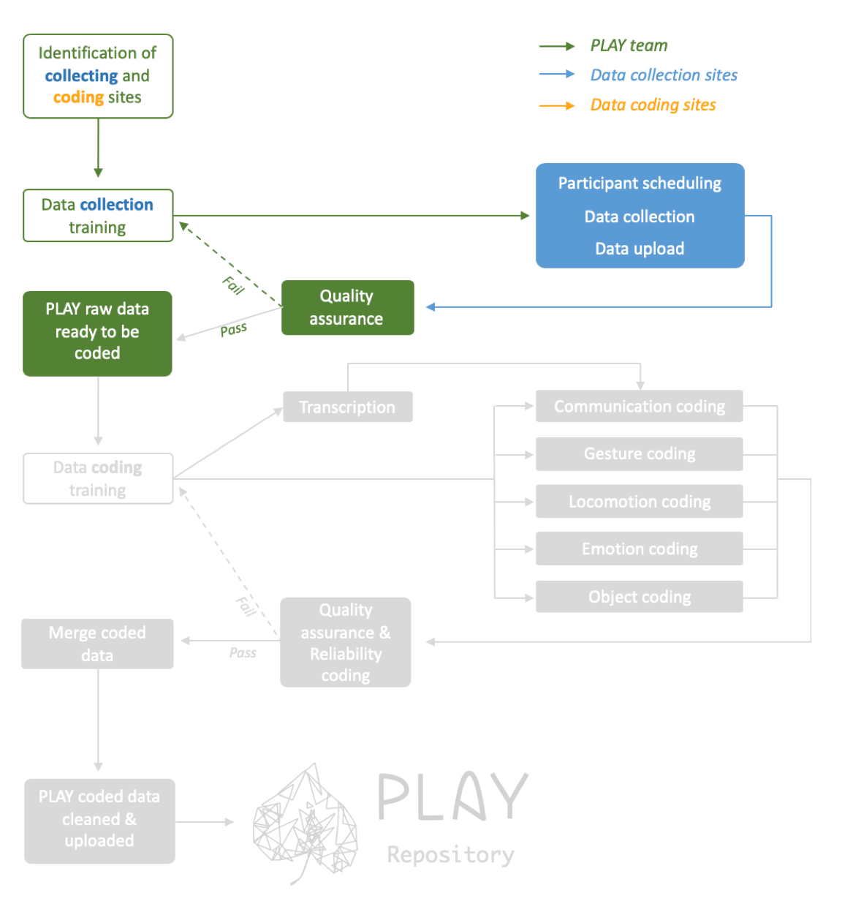

```{r setup, include=FALSE}
knitr::opts_chunk$set(echo = FALSE)
source("R/write_video_clip_html.R")
```


# Collection overview

The collaborating sites in PLAY perform a variety of roles (see [people](people.html) for details). Each site that performs a **collecting** role is pre-assigned to complete all of the collecting functions (see in blue below). This page contains detailed help for the data collection and upload process. Click here for information about <a href="participants.html"><font color="#5B9BD5"><b> participant recruitment </b></font></a> .



# Home Visit


*(Please ensure that you have read through the [participants](participants.html) page before you continue)*

Now that you have set your target participant sample and have begun your recruitment process, these instructions will help you prepare for your participant home visit. Please ensure that you are  [**currently logged in at Databrary**](https://nyu.databrary.org/user/login) to view protected content in this webpage.  

<i> For confidentiality reasons, access to video exemplars is restricted to researchers with authorized access to [Databrary](http://databrary.org). To register for access, visit <http://databrary.org/register>. </i>  

Before you proceed, please ensure that you have completed all the steps listed in the [recruitment](recruitment.html) webpage, and have in your posession the list of items to take with you to the participant's home.  <br><br>


## 1. Arrival introduction

- Ask if you should take your shoes off. Ask for good place to place backpack and coat.
- Do not leave the tripod and other equipment lying around.
- Do not engage or warm up to the baby. Just need to make mom feel comfortable.

Say: <say>Thanks for letting us come to your home. The visit has a few parts.  
I’ll begin by video-recording you and [CHILD] as you go about your day. I will video-record you both for 1 hour. Then, I will ask [CHILD] to play with some toys both by him/herself and with you. <br>
Afterwards, I will ask you some general questions about your family and home, and about [CHILD]’s skills and routines.  
You will give me a walk-through of your home that I will record on video to get a sense of the places [CHILD] goes and things that he/she plays with. <br>
Do you have any questions? Let’s start with reading and signing the consent.</say>
<br><br>


## 2. Consent to participate, permission to share

Ask mom to review the following forms. When finished, give her a moment to look over each form and sign them.

1. [Databrary Release Language](https://databrary.org/access/policies/release-template.html) form asking for consent to participate in the study.
 
2. [Databrary form](https://www.databrary.org/policies/release-template.pdf) form asking for permission to share videos and metadata.  

Here are [videos](https://databrary.org/access/guide/investigators/release/asking/examples.html) that depict how to ask for permission to share and a [sample script](https://databrary.org/access/guide/investigators/release/asking/script.html). <br><br>


## 3. One-hour natural play video & noise measurement  

- Always try to stay toward the edge of rooms and doorways. You do not want to influence child to interact with you, or get in child's way.
- Anytime mom asks to turn off camera, do so and add that time to reach 60 mins of recording.


### 3.1 One-Hour Natural Play Video

<insert 4 videos here>

Say: <say>For the next hour, do anything you would typically do if I weren’t here. Try to ignore me as much as possible and I will stay out of the way. I will also try not to respond to you and [CHILD] so that he/she is not distracted. You can go anywhere in your home. You can play together or not. The idea is to capture what your typical day is like.</say>

- Keep camera on the child at all times. Specifically, ensure that the child’s whole body is visible on camera. If mom is in frame, capture as much of her body as possible without compromising view of the child.
- Record in front or to the side of the child as much as possible.
- Do not zoom in.
- Remain at as far a distance as possible (~3 to 5 m, hugging the wall) so that the child is not distracted by your presence.
- Try not to interact with the child or make eye contact with the child. Just watch through the view finder of the camera.
<br><br>

### 3.2 Shoes:

<insert videos here>

If child is wearing shoes, video-record the shoes after the session; take them off child and video the bottom, side, and top views. Zoom in with camera and comment on shoe type, heel (if any), and other observations.

### 3.3 Decibel Meter

Open the app on your tablet and start running it just before you begin recording the free play video portion of the visit. This process should be recorded on the video camera.  

- Open application (the application immediately starts recording noise levels upon startup).
- Place device in the most central place in the home (e.g., living room).
- The microphone should be facing towards the room (e.g., away from walls) and propped up on the microphone stand so that it is **not** lying flat against the surface of the space.
<br><br>

## 4. Structured five-minute mother-child play

Say: <say>We clean these toys before and after each visit</say>

Place the mat on a clearing on the floor and place the tote bag (with toys) in the middle of the mat.

Say: <say>Please sit next to [CHILD] on this mat. I’ll give you a set of toys. Please play with [CHILD] however you like.</say>

* Record so that the child and mother’s entire body and hands are captured.
* Use timer on camera to time engagement.
* After 5 minutes, say “Great job!”

## 5. Questionnaires

* [List of Questions on 12-mo Home Questionnaire](https://nyu.databrary.org/volume/254/slot/15048/-/asset/72494)

* [List of Questions on 18-mo Home Questionnaire](https://nyu.databrary.org/volume/254/slot/15048/-/asset/72492)

* [List of Questions on 24-mo Home Questionnaire](https://nyu.databrary.org/volume/254/slot/15048/-/asset/72493)

**Please note that presentation and format will differ in the app.**

<insert 4 videos here>

<!-- Need to rewrite the following section-->

### 5.1  General Questionnaire

Say: <say>I have some questions for you…” [Only give introduction to the sections that need introduction (i.e., MCDI and ECBQ)].</say>

* Give mom her own copy of the MCDI and the ECBQ form along for her to follow along easily
* Set up camera to record the questionnaires. You'll need to change the battery on the camera to ensure sufficient power.
* Sit next to the mom so that the camera can capture both you and the mom

### 5.2  MacArthur

* MacArthur should be administered in the primary language of the mom.
* Specific instructions and procedure are included in the questionnaire.
* Give mom her own copy to follow along

### 5.3  ECBQ

* Read instructions on questionnaire.
* Give mom her own copy to follow along
* Also give mom the sheet with the rating scale
<br><br>

## 6. Video House Walk-through while measuring rooms

Say: <say>Now, we would like to see the space that [CHILD] gets to explore throughout the day. Please walk me through your home as I follow with a camera, and take measurements of the spaces. As we walk around, please show me where you keep any objects — toys, books, sippy cups, anything like that — that [CHILD] might interact with regularly. Please show me where you keep his/her clothes to give us an idea of the kinds of things he/she wears.</say>

Video capture tips:  

- Watch recording through camcorder screen to ensure that the view is not blurry or shaky  
- Move the camera slowly and walk slowly  
- A clear and steady view, free of blurriness and shakiness, is necessary for detailed coding of the home environment

About room measurements:  

- You will measure all rooms in the house while you do the video walkthrough  
- A room is any space used by someone on a regular basis - bedrooms, kitchens, bathrooms, basements - they don't need to have windows  
- A room has to have a clear demarcation (e.g., a wall or an entry).
- Do not measure laundry rooms
- If the room has a short divider (e.g., when a kitchen and a living room are divided by a counter), count as one big room and measure accordingly.

Steps:  

1. Pause at the entrance of the room.
2. Audibly name the room by its function (e.g., <say>This is where [CHILD] sleeps</say>).
3. First, get as much of the **Entire Room** in frame as possible. Keep the camera zoomed out and make sure to capture the ceiling and the floor of the room.
4. Next, pan the camera SLOWLY from **Left to Right**.
5. Then, pan the camera to **Floor**, name the different types of surfaces in the space (hardwood, plush carpet, thin rug, linoleum, tile, etc.), and then pan to the **Ceiling**.
6. Hold the camera in one hand while you take measurements of the room using the other. <br>
    - Turn measure on by pressing ON/DIST button. Make sure the laser beam is visible. <br> 
    - Measure wall to wall, lengthwise and widthwise. <br>
    - If a room has an odd or asymmetrical shape (i.e., any shape other than a rectangle or a square), measure the largest rectangle or square area of the room. <br>
    - Place the base of the laser flat on the wall, push ON/DIST againt to send the beam across the room (avoid moldings, door castings, reflective surfaces) <br>
    - Repeat the above for the second dimension (length or width) <br>
    - Focus camera on laser measure for each measure and read numbers out loud with units (e.g. <say>eight point five feet</say>) <br>
7. Ask parent if child spends time in each room: <say>Does [CHILD] spend any time in this room?</say>
8. Ask parent about child’s objects in the room: <say>Do you keep anything for [CHILD] in this room? (If yes) Would you mind showing me?</say>
9. Ensure during the house walkthrough that the parent provides information on all of the following:
    - *Children's Sleeping Arrangements.* <say>Please show me where [CHILD] typically sleeps.</say>
    - *Child’s Clothes.* <say>Please show me where you keep [CHILD]’s clothes.</say>
    - *Child’s Books.* <say>Please show me where you keep [CHILD]’s books.</say>
    - *Child’s Toys.* <say>Please show me where you keep [CHILD]’s toys.</say>
10. Film the **Location** of the storage space (drawer, toy chest, cabinet) in clear context of the rest of the room. Then, SLOWLY and CLEARLY film the **Contents** of the storage space to show what is inside of it, zooming in if needed. (Overhead view for bed, crib, drawers, toy chest, etc.; Zoomed in side view for cabinet, closet, bookshelf, etc.)
11. Do ** *NOT* ** turn off the camera when walking to next room.
11. Walk SLOWLY.
<br><br>


## 7. Visit wrap-up

* Complete housing checklist and clean-up notes sections of the questionnaire battery.
* Ensure that mom has copies of the consent forms
* Look through checlist to ensure that all items have been collected and packed

# Clean up and Upload 

<This section needs to be more fleshed out - also need to add more detailed upload instructions>  

* When you arrive back at the lab, wash all toys and equipment thoroughly. Wipe down yoga mat. Rinse dish set in bleach-water.
* Check over all questionnaire responses and hit **Submit**.
* Upload videos and decibel data to Databrary.
