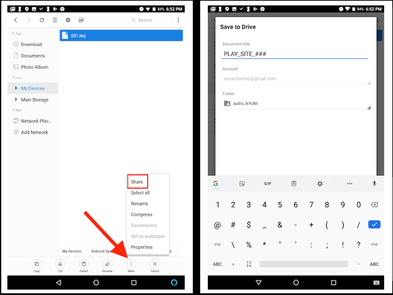

```{r setup, include=FALSE}
knitr::opts_chunk$set(echo = FALSE)
source("R/write_video_clip_html_SJ.R")
```

<br>

# Collection overview

The collaborating sites in PLAY perform a variety of roles (see [people](people.html) for details). Each site that performs a **collecting** role is pre-assigned to complete all of the collecting functions (see in blue below). This page contains detailed help for the data collection and upload process. Click here for information about <a href="participants.html"><font color="#5B9BD5"><b> participant recruitment </b></font></a> .


All videos that are collected with go through a quality assurance process in which the PLAY team will ensure that the videos are eligible to be included in the final sample. Videos that pass QA will then be passed on for coding. Videos that don't pass QA will be (depending on why they didn't) reused for other purposes or will be sent back to the collection site for modification. In some cases, the collection site might be provided additional training.  
<br><br>

<hr class="play">


# Participant Recruitment

```{r child = 'collection_recruitment.Rmd'}
```

<hr class="play">


# Home Visit

```{r child = 'collection_homevisit.Rmd'}
```

<hr class="play">

# Post Visit notes, Clean up, and Upload 

After each visit, when you arrive back at your lab, complete all the following steps on the day you collected the data or on the very next day.

1. Submit home questionnaires.
    - Open the completed questionnaire on the tablet and hit the submit button. Tablet must be connected to wifi.   
2. Complete and submit PLAY Post-Visit Notes   
    - https://ee.kobotoolbox.org/x/#2cAYQt3z   
3. Upload all videos from the visit to Databrary onto your university's PLAY volume. <br>
Use the naming convention for each of the four videos. Use your 5 letter code for SITE. Use 3 digits for subject number (###).
    - Name the session as: <b>PLAY_SITE_###</b>  
    - Name the Natural Play video as: <b>PLAY_SITE_###_NaturalPlay</b>  
    - Name the House Walkthrough video as: <b>PLAY_SITE_###_HouseWalkthrough</b>  
    - Name the Structured Play video as: <b>PLAY_SITE_###_StructuredPlay</b>  
    - Name the Questionnaires video as: <b>PLAY_SITE_###_Questionnaires</b>  
4. Select appropriate release level for session in Databrary.
    - https://www.databrary.org/resources/guide/investigators/release/release-levels.html
5. Make sure that all fields on Databrary are filled out. <br>
If visit is excluded mark as:
    - Pilot
    - Atypical
    - Out of age range
    - Cancelled (if visit was cancelled)
    - Experimental error (equipment malfunction)
    - Incomplete
6. Submit decibel data.
    - Please access the decibel app file on your tablet (located in the "AudioTool" folder in the File Manager). Select the decibel file from this home visit session. 
    - Select "Share with Save to Drive", navigate to the audio file folder for your site (e.g., ‘audio_NYUNI’) and drop your file in that location.
    - Name the file as follows: <b>PLAY_SITE_###</b>
    - 


7. Fill out form to submit session for quality assurance. https://forms.gle/dyqtsAxx3D8LJuTr8.
8. Clean equipment.
    - Wash all toys and equipment thoroughly.
    - Wipe down yoga mat.
    - Once videos have been uploaded, delete all videos from SD card.
    - Make sure to put away all equipment to have ready for a next visit.

