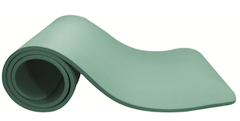
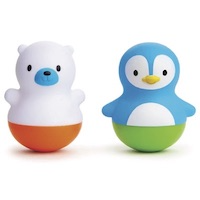

```{r setup, include=FALSE}
knitr::opts_chunk$set(echo = FALSE)
source("R/write_video_clip_html.R")
```

<!-- Todo:
Embed videos from here: https://nyu.databrary.org/volume/876/slot/35422/-?asset=174039
In this format: 
https://nyu.databrary.org/slot/35422/asset/174041/download?inline=true
-->

# Collection overview

The collaborating sites in PLAY perform a variety of roles (see [people](people.html) for details). Each site that performs a **collecting** role is pre-assigned to complete all of the collecting functions (see in blue below). This page contains detailed help for the data collection and upload process. Click here for information about <a href="participants.html"><font color="#5B9BD5"><b> participant recruitment </b></font></a> .


All videos that are collected with go through a quality assurance process in which the PLAY team will ensure that the videos are eligible to be included in the final sample. Videos that pass QA will then be passed on for coding. Videos that don't pass QA will be (depending on why they didn't) reused for other purposes or will be sent back to the collection site for modification. In some cases, the collection site might be provided additional training.  
<br><br>

# Participant Recruitment

## 1. Scheduling visit

*To schedule a visit, you will be making two phone calls to each family: the initial recruiting call and the confirmation call (if the family agrees to participate). Depending on the availability of the mother, you will complete the [participant paperwork](link to questionnaires)*

<!--
List of videos in volume (protocol materials):
https://nyu.databrary.org/volume/876/slot/35422/-
-->

### 1.1 Initial recruiting phone call (option 1/3)

<!-- Indenting this code will mess up the output - markdown seems to want to read indented code as textboxes -->
<!-- When knitting, make sure to "open in browswer" to see video - need to be logged into DB!! -->
<div class="videobuttons">

<button size="xs" type="button" data-toggle="collapse" data-target="#collection-scheduling-initialrecruitingcall">
Video
</button>
</div>
<div id="collection-scheduling-initialrecruitingcall" class="collapse" aria-expanded="false" style="height: 0px;">
<video width="100%" controls="" preload="none">
<source src="https://nyu.databrary.org/slot/14765/0,79273/asset/64898/download?inline=true" type="video/mp4"> Your browser does not support html5 video.
</video>
</div>

<say>Hi, may I speak with [MOM]?
My name is [CALLER NAME] and I’m calling from [LAB] about a home study where we're looking at how moms and children interact with each other. We'd be visitng your home and you'd receive $25 at the end of the visit for your participation. Can we tell you about it?
First, I have some questions to see if you and [CHILD] qualify for the study. 

<say> Does [CHILD]have any siblings?</say>

- → *If yes: **end call**.* <say>In this study, we are currently looking for only-children. Would it be alright if we contacted you for other studies in the future?</say>
- → *If no: continue*

<say>What language(s) do you speak to [CHILD]?</say>

- → *If not ENGLISH or SPANISH: **end call**.* <say>To control for differences in communication, we are looking for families who speak mainly English or Spanish. Would it be alright if we contacted you for other studies in the future?</say>
- → *If mainly English/Spanish: continue*

<say>Was [CHILD] born on his/her due date? (If not: “How many weeks and days early/late was he/she?”)<say>

- → *If more than 4 weeks early: **end call**.* <say>In this study, we are currently looking for children born on term. Would it be alright if we contacted you for other studies in the future?<say>
- → *If born on term (37-41 weeks): continue*

<say>Has [CHILD] been diagnosed with any disability (cognitive, auditory, vision, motor)?</say> 

- → *If yes: **end call**.* <say>In this study, we are looking for typically developing children. Would it be alright if we contacted you for other studies in the future?</say> 
- → *If no: continue*

<say>For this study, we are interested in learning about children’s natural, everyday experiences in their homes. A researcher will visit you and [CHILD] in your home for about 2.5 hours. You and [CHILD] will be video recorded for 1 hour as you go about your day, followed by questions on [CHILD]'s skills and routines. We will ask you to take us through your home as we record the environment. For your participation, we will compensate you with $25 at the end of the session.
The data collected in this study are valuable and will be placed in a secure web-based library available only to researchers. The purpose is to share the data with experts in the field so that scientists can learn more about infant development.
Does this sound like something you would be interested in participating in with [CHILD]?</say>

- → *If no to study or to sharing video on Databrary: **end call** * <say>Okay, thank you. May we call you for other studies?</say>
- → *If yes: continue* 

<say>Great! Because we are interested in mother-infant routines, we'd like to find a time and date when we can observe just <span style="text-decoration:underline">**you and [CHILD]**</span> at home. It would be great if we can schedule a time that is not during a typical mealtime and when [CHILD] is usually awake. Is there a convenient time and day that works best for you that would be within these criteria?</say>

- → *If the date they are available puts child out of age range: **end call** * <say>For this study, we are interested in studying specific age groups: 12-, 18-, and 23-month olds. Would it be possible for us to contact you in XX months to see if [CHILD] can participate then?</say>
- → *If dates are available when child is still within eligible age range: continue*

<say>Before the study, we have a few questions that we'd like to ask. It should only take about 5 minutes. We can either ask you now or when we call to confirm the study. What would you prefer?</say>

- → *If ready to answer now, continue*:
    - On your tablet, open Kobo toolbox and start a new questionnaire set
    - Fill out participant information at top of new session
    - “Save as Draft” after Phone Questionnaire and home visit questionnaires
    - Only hit “Submit” after filling out clean-up notes back in lab
    - [List of questions on the Phone Questionnaire](https://nyu.databrary.org/volume/254/slot/15048/-/asset/63741)
    - *Please note that presentation and format will differ in the app.*
- → *If not available now* <say>When will be a good time to call back about the questions?</say>
    - If another time work, schedule a 5-minute call to complete phone questionnaire
    - If difficult to find a time up to 2 days before visit, complete phone questionnaire when confirming visit

<say>So I have you and [CHILD] for our study on [DATE] at [TIME]. We'll be calling you the day before (if study is on Monday: the Friday before) your appointment to confirm that that time still works for you. Have a great day!</say>  

<br>
  
### 1.2 Initial recruiting voicemail (Option 2/3)

If you reach the family's voicemail, please leave the following message:

<say>Hi, this message is for [MOM]. My name is [NAME] and I’m calling from [LAB]. I’m calling because we have a fun study for [12 / 18 / 24]-month-olds and [CHILD] is the perfect age. You would receive $25 for participating in the study and if you are interested in hearing more, please give us a call back. Our phone number is [XXX-XXX-XXXX]. Thank you and we hope to hear from you soon!</say>  

<br>

### 1.3 Initial recruiting email (Option 3/3)

If you will be contacting the family over email, you may use the following template:

~~~
Dear [MOM],
  
I am writing from the [LAB] to tell you about a fun study that [CHILD] would be perfect for!

For this study, we are interested in learning about babies' natural, everyday experiences in their homes — such as the toys they play with and the places they go. A researcher will visit you and [CHILD] in your home, and the two of you will be video recorded as you go about your day. The visit lasts about 3 hours, and you will receive a $50 Visa gift card at the end of the session.
If you are interested in participating, would like more information, or have any questions, feel free to contact us by email or phone. Our phone number is [XXX-XXX-XXXX]. We look forward to hearing from you soon!

Thank you, 
[LAB]
~~~

<br>

## 2. Establishing visit details

Once you have connected with the family and decided on a visit date, please send the following email to establish the visit details:

~~~
Dear [MOM],

Thank you very much for agreeing to participate in our home visit study with [CHILD]. Here is a confirmation of the date and time of your appointment:

*Date: [DAY OF WEEK], [DATE] 
*Time: [START TIME] – [END TIME] 
Your Home Address: [ADDRESS]

We look forward to seeing you on the day of your appointment! If the above address is incorrect, please email back or call us right away. If you have any other questions about this appointment, feel free to contact us at [XXX-XXX-XXXX].

Thank you, 
[LAB]
~~~

<br>

## 3. Confirming a visit (day before the visit)

### 3.1 Confirmation phone call (Option 1/2)

<say>Hi, may I speak with [MOM]? My name is [NAME] and I’m calling from [LAB] to confirm our visit with you and [CHILD] on [DATE]. Does this time and date still work for you?</say>

- → *If yes:* 
    - → *If phone questionnaire was not completed during initial phone call:* <say>That's great! Before the visit, I’d like to ask you a few questions. It will only take 5 minutes of your time.</say> 
        - On your tablet, open Kobo toolbox and start a new questionnaire set
        - Fill out participant information at top of new session
        - “Save as Draft” after Phone Questionnaire and home visit questionnaires
        - Only hit “Submit” after filling out clean-up notes back in lab
        - [List of questions on the Phone Questionnaire](https://nyu.databrary.org/volume/254/slot/15048/-/asset/63741)
        - *Please note that presentation and format will differ in the app.*
        - Wrap up the call - <say>I will see you [date/time]. Just as a reminder, the data we collect from you now and during the visit, will be shared on a web-based library only available to researchers like the professor who runs this lab.</say>
    - → *If phone questionnaire has been completed:* - <say>That's great! I will see you [date/time]. Just as a reminder, the data we collect from you now and during the visit, will be shared on a web-based library only available to researchers like the professor who runs this lab.</say>
- → *If no:* rechedule, make sure that child will still be within age range


### 3.2 Confirmation voicemail (option 2/2)

If you reach the family's voicemail, please leave the following message:

“Hi, this message is for [MOM]. My name is [NAME] and I’m calling from [LAB]. I’m calling about the home study visit we have scheduled for you and [CHILD] on [DATE] at [TIME]. Please call us back and let us know if that time and date still you works for you. Our phone number is [XXX- XXX-XXXX]. Thank you and we hope to hear from you soon!”

### 3.3 Confirmation email

If you have the family's email address, it is always advisable to send a confirmation email. You may use the following template:

~~~
Dear [MOM],

Thank you very much for agreeing to participate in our home study with [CHILD]. Please let us know if this appointment still works for you! Here is a confirmation of the time and date of your appointment:

Date: [DAY OF WEEK], [DATE] 
Time: [START TIME] – [END TIME]
Your Home Address: [ADDRESS]

We look forward to seeing you tomorrow! Please let us know if this appointment still works for you. If the above address is incorrect, please email or call us back right away. If you have any other questions about this appointment, feel free to contact us at [XXX-XXX-XXXX].

Thank you, 
[LAB]
~~~

<br>

<!--
<div class="videobuttons">

<button size="xs" type="button" data-toggle="collapse" data-target="#collection-scheduling-confirmingvisit-12mc">
12m crawler
</button>
</div>
<div id="collection-scheduling-confirmingvisit-12mc" class="collapse" aria-expanded="false" style="height: 0px;">
<video width="100%" controls="" preload="none">
<source src="https://nyu.databrary.org/slot/35422/0,440000/asset/174038/download?inline=true" type="video/mp4"> Your browser does not support html5 video.
</video>
</div>

<div class="videobuttons">

<button size="xs" type="button" data-toggle="collapse" data-target="#collection-scheduling-confirmingvisit-12mw">
12m walker
</button>
</div>
<div id="collection-scheduling-confirmingvisit-12mw" class="collapse" aria-expanded="false" style="height: 0px;">
<video width="100%" controls="" preload="none">
<source src="https://nyu.databrary.org/slot/35422/0,381000/asset/174038/download?inline=true" type="video/mp4"> Your browser does not support html5 video.
</video>
</div>

<div class="videobuttons">

<button size="xs" type="button" data-toggle="collapse" data-target="#collection-scheduling-confirmingvisit-18m">
&nbsp;&nbsp;&nbsp;&nbsp;&nbsp;&nbsp;&nbsp;&nbsp;18m&nbsp;&nbsp;&nbsp;&nbsp;&nbsp;&nbsp;&nbsp;&nbsp;
</button>
</div>
<div id="collection-scheduling-confirmingvisit-18m" class="collapse" aria-expanded="false" style="height: 0px;">
<video width="100%" controls="" preload="none">
<source src="https://nyu.databrary.org/slot/35422/asset/174040/download?inline=true" type="video/mp4"> Your browser does not support html5 video.
</video>
</div>

<div class="videobuttons">

<button size="xs" type="button" data-toggle="collapse" data-target="#collection-scheduling-confirmingvisit-24m">
&nbsp;&nbsp;&nbsp;&nbsp;&nbsp;&nbsp;&nbsp;&nbsp;24m&nbsp;&nbsp;&nbsp;&nbsp;&nbsp;&nbsp;&nbsp;&nbsp;
</button>
</div>
<div id="collection-scheduling-confirmingvisit-24m" class="collapse" aria-expanded="false" style="height: 0px;">
<video width="100%" controls="" preload="none">
<source src="https://nyu.databrary.org/slot/35422/asset/174041/download?inline=true" type="video/mp4"> Your browser does not support html5 video.
</video>
</div>

-->


## 4. Preparing for Visit

### 4.1 Pack

<div>
<table width="70%">
<tr>
<td width="20%"> Camera, SD card and extra battery </td>
<td width="25%" style="padding-right: 40px;">  </td>
<td width="10%"> </td>
<td width="20%"> Microphone with sponge cover  </td>
<td width="25%">  </td>
</tr>
<tr>
<td width="20%"> Fully loaded and charged tablet</td>
<td width="25%">  </td>
<td width="10%"> </td>
<td width="20%"> Laser Measure  </td>
<td width="25%" style="padding-right: 40px;">  </td>
</tr>
<tr>
<td width="20%"> Decibel meter mic  </td>
<td width="25%" style="padding-right: 40px;">  </td>
<td width="10%"> </td>
<td width="20%"> Tripod for camera</td>
<td width="25%">  </td>
</tr>
<tr>
<td width="20%"> Tote bag  </td>
<td width="25%">  </td>
<td width="10%"> </td>
<td width="20%"> Yoga mat </td>
<td width="25%" style="padding-right: 40px;">  </td>
</tr>
<tr>
<td width="20%"> Dish set  </td>
<td width="25%">  </td>
<td width="10%"> </td>
<td width="20%"> Toy </td>
<td width="25%" style="padding-right: 40px;">  </td>
</tr>
<tr>
<td width="20%"> Binder with answer scales  </td>
<td width="25%" style="padding-right: 40px;">  </td>
<td width="10%"> </td>
<td width="20%"> Paper backups of all questionnaires and forms </td>
<td width="25%">  </td>
</tr>
<tr>
<td width="20%"> Participant payment  </td>
<td width="25%" style="padding-right: 40px;">  </td>
<td width="10%"> </td>
<td width="20%">  </td>
<td width="25%">  </td>
</tr>
</table>
</div>

<br>

### 4.2 Prepare

1. Take your own water with you. For the duration of the visit, you will decline any offerings of food or drink.
2. Take your university ID with you, be prepared to show it if asked.  
3. Dress plainly, modestly, neutrally. Nothing too bright and attractive to children. Try not to wear all black either :) 
4. Avoid strong perfumes and noisy jewelry. The idea is to blend into the background as much as possible.
5. Be prepared to plan your bathroom breaks around the visit (it will be approx 2.5 hrs long).


<!--
- Camera, SD card and extra battery 
- Mic 
- Laser Measure 
- Dish set, doll, and tote bag 
- Yoga mat 
- Tablet with app for questionnaires, study consent form, Databrary sharing release form, and decibel meter mic 
- Participant payment 
- Paper copies of all questionnaires, MCDI, and consent and Databrary forms in case of tablet failure
-->


# Home Visit

<!-- *(Please ensure that you have read through the [participants](participants.html) page before you continue)* -->

Now that you have set your target participant sample and completed all the steps listed in the [recruitment](recruitment.html) process, these instructions will help you prepare for your participant home visit. <br><br>

<div class = "bluebg">
Please ensure that you are  [**currently logged in at Databrary**](https://nyu.databrary.org/user/login) to view protected content in this webpage. <i> For confidentiality reasons, access to video exemplars is restricted to researchers with authorized access to [Databrary](http://databrary.org). To register for access, visit <http://databrary.org/register>. </i>  
</div>


<br>

At the end of data collection, you will upload _exactly 4 videos_ to your Databrary repository:  

1. One-hour naturalistic play (include: decibel measure, shoes _if child is wearing them in the house_)
2. House walkthrough (include: measurements of each room, sleeping arrangements, clothing, books, toys, shoes _if child is barefoot_)
3. 5-min structured play (focus on child and mom, even if they leave mat area)
4. Questionnaires (set up camera on tripod, focus on mom)
<br>

## 1. Arrival introduction

- Ask if you should take your shoes off. Ask for good place to place backpack and coat.
- Do not leave the tripod and other equipment lying around.
- Do not engage or warm up to the baby. Just need to make mom feel comfortable.

Say: <say>Thanks for letting us come to your home. The visit has a few parts.  
I’ll begin by video-recording you and [CHILD] as you go about your day. I will video-record you both for 1 hour. Then, I will ask [CHILD] to play with some toys both by him/herself and with you. <br>
Afterwards, I will ask you some general questions about your family and home, and about [CHILD]’s skills and routines.  
You will give me a walk-through of your home that I will record on video to get a sense of the places [CHILD] goes and things that he/she plays with. <br>
Do you have any questions? Let’s start with reading and signing the consent.</say>
<br><br>

## 2. Consent to participate, permission to share

Ask mom to review the following forms. When finished, give her a moment to look over each form and sign them.

1. [Databrary Release Language](https://databrary.org/access/policies/release-template.html) form asking for consent to participate in the study.
 
2. [Databrary form](https://www.databrary.org/policies/release-template.pdf) form asking for permission to share videos and metadata.  

Here are [videos](https://databrary.org/access/guide/investigators/release/asking/examples.html) that depict how to ask for permission to share and a [sample script](https://databrary.org/access/guide/investigators/release/asking/script.html). <br><br>


## 3. One-hour natural play video & noise measurement  

- Aim to get 60 minutes of natural play recoding, in addition to the time you take to record the decibel meter and shoes.
- Always try to stay toward the edge of rooms and doorways. You do not want to influence child to interact with you, or get in child's way.
- Anytime mom asks to turn off camera, do so and add that time to reach 60 mins of recording.

### 3.1 Decibel Meter

When you are ready to record the one-hour natural play, hold the video camera in one hand, point it to the ground, turn it on, and say: <say>We would like to measure the environmental noise levels. Is there a good place where I can put this measuring device where your child cannot reach? The tablet only measures the environmental noise measures and not what you’re actually saying.</say>

- Point the video camera at the tablet
- Open the decibel meter application (the application immediately starts recording noise levels upon startup).
- Place device in the most central place in the home (e.g., living room).
- The microphone should be facing towards the room (e.g., away from walls) and propped up on the microphone stand so that it is **not** lying flat against the surface of the space.
<br><br>

For detailed instructions with screenshots, [click here](https://nyu.databrary.org/volume/876/slot/39021/-/asset/191469).

### 3.2 One-Hour Natural Play Video

<insert example one-hour video here>

Point the video camera towards mom and say: <say>For the next hour, do anything you would typically do if I weren’t here. Try to ignore me as much as possible and I will stay out of the way. I will also try not to respond to you and [CHILD] so that he/she is not distracted. You can go anywhere in your home. You can play together or not. The idea is to capture what your typical day is like.</say>

- Note the time on the camera and ensure that you will be recording for an additional 60 minutes.
- Keep camera on the child at all times. Specifically, ensure that the child’s whole body is visible on camera. If mom is in frame, capture as much of her body as possible without compromising view of the child.
- Record in front or to the side of the child as much as possible.
- Do not zoom in.
- Remain at as far a distance as possible (~3 to 5 m, hugging the wall) so that the child is not distracted by your presence.
- Try not to interact with the child or make eye contact with the child. Just watch through the view finder of the camera.  

##### Shoes

* If child was wearing shoes during the recording, say “Could I get a close-up of the shoes [CHILD] has been wearing?”. Ask mom to remove the shoes, video-record the shoes after the session; take them off child and video the bottom, side, and top views. Zoom in with camera and comment on shoe type, heel (if any), and other observations.  
* If the child was _not_ wearing shoes during the one-hour recording, get a video of the shoes during the house walkthrough. The recording of the shoes must either be a part of the one-hour video or the house walkthrough video - we do not need a separate recording. Shoes can be found at the entrance if the family doesn’t wear them around the house. Or you can ask about shoes when you’re in the child’s room. Pick up both shoes and record the bottom, side, and top views. Zoom in with camera and comment on shoe type, heel (if any), and other observations.  

At the end of the one-hour recording, say: <say>Great, we are done with the one-hour recording!</say>  
With camera in hand (and still recording), walk over to where the tablet was placed, and hit the “save” button. Then stop the camera recording. Name the file with the participant ID and quit.


## 4. Video House Walk-through while measuring rooms

Say: <say>Now, we would like to see the space that [CHILD] gets to explore throughout the day. Please walk me through your home as I follow with a camera, and take measurements of the spaces. As we walk around, please show me where you keep any objects — toys, books, sippy cups, anything like that — that [CHILD] might interact with regularly. Please show me where you keep his/her clothes to give us an idea of the kinds of things he/she wears.</say>

Ensure that all of experimenter's personal items, recording equipment, yoga mat and toys for structured play are stored out of sight.  

Video capture tips:  

- Watch recording through camcorder screen to ensure that the view is not blurry or shaky  
- Move the camera slowly and walk slowly  
- A clear and steady view, free of blurriness and shakiness, is necessary for detailed coding of the home environment
- The laser measure device does not work against reflective surfaces (mirrors, glass walls, etc), so point to a non-reflective surface or measure from the reflective surface towards the opposite direction.

About room measurements:  

- You will measure all rooms in the house while you do the video walkthrough  
- A room is any space used by someone on a regular basis - bedrooms, kitchens, bathrooms, basements - they don't need to have windows  
- A room has to have a clear demarcation (e.g., a wall or an entry). A space is considered to be a room if it has a minimum of 3 walls.
- Do not measure laundry rooms
- If the room has a short divider (e.g., when a kitchen and a living room are divided by a counter), count as one big room and measure accordingly.

Steps:  

1. Pause at the entrance of the room.
2. Audibly name the room by its function (e.g., <say>This is where [CHILD] sleeps</say>).
3. First, get as much of the **Entire Room** in frame as possible. Keep the camera zoomed out and make sure to capture the ceiling and the floor of the room.
4. Next, pan the camera SLOWLY from **Left to Right**.
5. Then, pan the camera to **Floor**, name the different types of surfaces in the space (hardwood, plush carpet, thin rug, linoleum, tile, etc.), and then pan to the **Ceiling**.
6. Hold the camera in one hand while you take measurements of the room using the other. <br>
    - Turn measure on by pressing ON/DIST button. Make sure the laser beam is visible. <br> 
    - Measure wall to wall, lengthwise and widthwise. <br>
    - If a room has an odd or asymmetrical shape (i.e., any shape other than a rectangle or a square), measure the largest rectangle or square area of the room. <br>
    - Place the base of the laser flat on the wall, push ON/DIST againt to send the beam across the room (avoid moldings, door castings, reflective surfaces) <br>
    - Repeat the above for the second dimension (length or width) <br>
    - Focus camera on laser measure for each measure and read numbers out loud with units (e.g. <say>eight point five feet</say>) <br>
7. Ask parent if child spends time in each room: <say>Does [CHILD] spend any time in this room?</say>
8. Ask parent about child’s objects in the room: <say>Do you keep anything for [CHILD] in this room? (If yes) Would you mind showing me?</say>
9. **Ensure during the house walkthrough that the parent provides information on all of the following:**
    - *Children's Sleeping Arrangements.* <say>Please show me where [CHILD] typically sleeps.</say>
    - *Child’s Clothes.* <say>Please show me where you keep [CHILD]’s clothes.</say>
    - *Child’s Shoes.* <say>Please show me where you keep [CHILD]’s shoes.</say>
    - *Child’s Books.* <say>Please show me where you keep [CHILD]’s books.</say>
    - *Child’s Toys.* <say>Please show me where you keep [CHILD]’s toys.</say>
10. Film the **Location** of the storage space (drawer, toy chest, cabinet) in clear context of the rest of the room. Then, SLOWLY and CLEARLY film the **Contents** of the storage space to show what is inside of it, zooming in if needed. (Overhead view for bed, crib, drawers, toy chest, etc.; Zoomed in side view for cabinet, closet, bookshelf, etc.)
11. Do ** *NOT* ** turn off the camera when walking to next room.
11. Walk SLOWLY.
<br><br>


## 5. Structured five-minute mother-child play

<div class="videobuttons">

<button size="xs" type="button" data-toggle="collapse" data-target="#collection-homevisit-structuredplay-pview">
Video
</button>
</div>
<div id="collection-homevisit-structuredplay-pview" class="collapse" aria-expanded="false" style="height: 0px;">
<video width="100%" controls="" preload="none">
<source src="https://nyu.databrary.org/slot/35422/42651425,42955319/asset/189087/download?inline=true" type="video/mp4"> Your browser does not support html5 video.
</video>
</div>

Say: <say>Now I would like you to play with your child for about 5 minutes with these toys. We always clean these toys before and after each visit. I have a mat that I’m going to ask you to sit on. Where’s a good place for me to put it?</say>

Place the mat on a clearing on the floor.

Say: <say>Please sit next to [CHILD] on this mat. I’ll give you a set of toys. Please play with [CHILD] however you like for 5 minutes.</say>

* If the child is playing with a different toy before the recording, ask mom if she can put the toy away.
* Hand tote bag with toys to mom.
* Record so that the child and mother’s entire bodies - faces, eyes, and hands - are captured. If child stands up, make sure to capture the feet. If you are in a position from which you cannot capture the full face and both eyes, position yourself to capture a profile view.
* If child and mom are separated at any point, focus camera on child.
* Use timer on camera to time engagement.
* After 5 minutes, say “Great job! We can now move on to the questionnaires.”
* If the child is still playing with the toys after 5 minutes, let the child play and continue on to the questionnaires.

## 6. Questionnaires

<!-- * [List of Questions on 12-mo Home Questionnaire](https://nyu.databrary.org/volume/254/slot/15048/-/asset/72494) -->

<!-- * [List of Questions on 18-mo Home Questionnaire](https://nyu.databrary.org/volume/254/slot/15048/-/asset/72492) -->

<!-- * [List of Questions on 24-mo Home Questionnaire](https://nyu.databrary.org/volume/254/slot/15048/-/asset/72493) -->


```{r child = 'questionnaires.Rmd'}
```
<br><br>

## 7. Visit wrap-up

* Give mom the payment
* Ensure that mom has copies of the consent and Databrary forms
* Collect and pack all equipment and paperwork from the house
* Thank mom for letting us come to her home!

# Clean up and Upload 

When you arrive back at the lab, please complete these steps on the day you collected data or on the very next day:

Clean up: 
* Wash all toys and equipment thoroughly. 
  * Wipe down yoga mat. 
  * Rinse dish set in bleach-water.

<<<<<<< HEAD
Upload:
* Complete housing checklist and clean-up notes sections of the questionnaire battery.
* Check through all questionnaire responses and hit Submit.
* Upload videos and decibel data to Databrary. (Uploading manual coming soon)
=======


* Clean up
    * When you arrive back at the lab, wash all toys and equipment thoroughly. 
    * Wipe down yoga mat. Rinse dish set in bleach-water. 
    * Check over all questionnaire responses and hit Submit.
  * Upload
>>>>>>> 119ff3a8dc330a404f426aedc2a024f67593f32d
