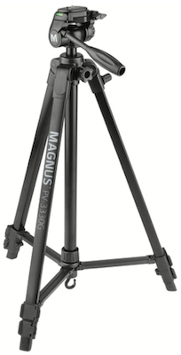
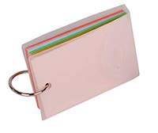

## 1. Pack

<table width="80%">
<tr>
<td width="25%">
<!--Start info button-->
<a href="https://shop.panasonic.com/cameras-and-camcorders/camcorders/HC-V770K.html">

Camera </a> &#9432;
   Panasonic HC-V770 Full HD Video Camera Camcorder 

<!--End info button-->
<!--Start info button-->

SD Card &#9432;
  SanDisk 64GB Extreme PRO UHS-I SDXC Memory Card

<!--End info button-->
<!--Start info button-->

 Extra battery &#9432;
  Panasonic Battery and Charger Kit (for HC-V77 Camcorders)

<!--End info button-->
</td>
<td width="25%" style="padding-right: 40px;">  </td>
<td width="10%"> </td>
<td width="20%">   
<!--Start info button-->

 Microphone with sponge cover &#9432;
   Veksun camera microphone 

<!--End info button-->
</td>
<td width="25%">  </td>
</tr>
<tr>
<td width="20%"> 
<!--Start info button-->

 Fully loaded and charged tablet &#9432;
   Lenovo 8 Tab 4 8 16GB Tablet (Wi-Fi Only)

<!--End info button-->
<!--Start info button-->

 Tablet case &#9432;
   MoKo Lenovo Tab 4 8" Case 

<!--End info button-->
</td>
<td width="25%">  </td>
<td width="10%"> </td>
<td width="20%"> 
<!--Start info button-->

 Laser Measure &#9432;
   Tacklilfe S2 Advanced Laser Measure  

<!--End info button-->
</td>
<td width="25%" style="padding-right: 40px;">  </td>
</tr>
<tr>
<td width="20%"> 
<!--Start info button-->

 Decibel meter mic &#9432;
   Dayton Audio iMM-6 Microphone 

<!--End info button-->  
</td>
<td width="25%" style="padding-right: 40px;">  </td>
<td width="10%"> </td>
<td width="20%"> 
<!--Start info button-->
<a href="https://www.bhphotovideo.com/c/product/1429467-REG/magnus_pv_3330g_3_section_photo_video_tripod.html">

 Tripod </a> &#9432;
   Magnus PV-3330G Photo/Video Tripod 

<!--End info button-->
</td>
<td width="25%">  </td>
</tr>
<tr>
<td width="20%">   
<!--Start info button-->

 Tote bag &#9432;
   Clear Tote Bag (12"X 12"X 6") 

<!--End info button-->  
</td>
<td width="25%">  </td>
<td width="10%"> </td>
<td width="20%">  
<!--Start info button-->

 Yoga mat &#9432;
   Gaiam Essentials Thick Yoga Mat 

<!--End info button-->  
</td>
<td width="25%" style="padding-right: 40px;">  </td>
</tr>
<tr>
<td width="20%"> 
<!--Start info button-->
<a href="https://www.greentoys.com/products/green-toys-dish-set-24-piece-set">

Dish set </a> &#9432;
   Green Toys Dish Set 

<!--End info button-->
</td>
<td width="25%">  </td>
<td width="10%"> </td>
<td width="20%"> 
<!--Start info button-->
<a href="https://www.munchkin.com/bath-bobbers.html">

 Toy </a> &#9432;
   Munchkin Bath Bobbers 

<!--End info button-->
</td>
<td width="25%" style="padding-right: 40px;">  </td>
</tr>
<tr>
<td width="20%"> Participant payment  </td>
<td width="25%" style="padding-right: 40px;">  </td>
<td width="10%"> </td>
<td width="20%"> <a href="https://nyu.databrary.org/volume/876/slot/39021/-?asset=204156"> Flash cards </a> </td>
<td width="25%" style="padding-right: 40px;">  </td>
</tr>
<tr>
<td width="20%">
<!--Start info button-->

 2 copies of study consent forms - one for parent, one signed copy for lab records</a> &#9432;
   Please contact lab PI to get your lab-specific copy of this form 

<!--End info button-->
</td>
<td width="25%" style="padding-right: 40px;">  </td>
<td width="10%"> </td>
<td width="20%">
<!--Start info button-->

 2 copies of Databrary permission forms - one for parent, one signed copy for lab records</a> &#9432;
   Please contact lab PI to get your lab-specific copy of this form 

<!--End info button-->
</td>
<td width="25%" style="padding-right: 40px;">  </td>
<td width="10%"> </td>
</tr>
<tr>
<td width="20%"> Answer scales in <a href="https://nyu.databrary.org/volume/876/slot/39021/-?asset=191468"> English </a> & <a href="https://nyu.databrary.org/volume/876/slot/39021/-?asset=204157"> Spanish </a> </td>
<td width="25%" style="padding-right: 40px;">  </td>
<td width="10%"> </td>
<td width="20%"> Paper backups of <a href="https://www.play-project.org/collection.html#6_questionnaires"> all questionnaires and forms </a> </td>
<td width="25%">  </td>
</tr>
</table>

 

## 2. Prepare

1. Take your own water with you. For the duration of the visit, you will decline any offerings of food or drink.
2. Take your university ID with you, be prepared to show it if asked.  
3. Dress plainly, modestly, neutrally. Nothing too bright and attractive to children. Try not to wear all black either :) 
4. Avoid strong perfumes and noisy jewelry. The idea is to blend into the background as much as possible.
5. Be prepared to plan your bathroom breaks around the visit (it will be approx 2.5 hrs long).

## 3. COVID Considerations

At each home visit, researchers abide by the following protections:

* Wear a _mask_ at all times
* Clean any equipment that is placed on a home surface (decibel meter, tablet) with a sanitizing wipe.
* Have only mothers open closets, cabinets, and doors during the house walk-through
* Hand toys for structured play to parents in a sanitized plastic tote bag
* Explain to mothers the research importance of not wearing a mask——to allow observation and coding of facial expressions

After each home visit, researchers will sanitize all toys, the camera, tripod, microphones, tablet, and all bags.
