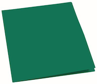

```{r child = 'collection_recruitment_1scheduling.Rmd'}
```

<br>

```{r child = 'collection_recruitment_2establishing.Rmd'}
```

<br>

```{r child = 'collection_recruitment_3confirming.Rmd'}
```

<br>

## 4. Preparing for Visit

### 4.1 Pack

<div>
<table width="70%">
<tr>
<td width="20%"> Camera, SD card and extra battery </td>
<td width="25%" style="padding-right: 40px;">  </td>
<td width="10%"> </td>
<td width="20%"> Microphone with sponge cover  </td>
<td width="25%">  </td>
</tr>
<tr>
<td width="20%"> Fully loaded and charged tablet</td>
<td width="25%">  </td>
<td width="10%"> </td>
<td width="20%"> Laser Measure  </td>
<td width="25%" style="padding-right: 40px;">  </td>
</tr>
<tr>
<td width="20%"> Decibel meter mic  </td>
<td width="25%" style="padding-right: 40px;">  </td>
<td width="10%"> </td>
<td width="20%"> Tripod for camera</td>
<td width="25%">  </td>
</tr>
<tr>
<td width="20%"> Tote bag  </td>
<td width="25%">  </td>
<td width="10%"> </td>
<td width="20%"> Yoga mat </td>
<td width="25%" style="padding-right: 40px;">  </td>
</tr>
<tr>
<td width="20%"> Dish set  </td>
<td width="25%">  </td>
<td width="10%"> </td>
<td width="20%"> Toy </td>
<td width="25%" style="padding-right: 40px;">  </td>
</tr>
<tr>
<td width="20%"> Binder with answer scales  </td>
<td width="25%" style="padding-right: 40px;">  </td>
<td width="10%"> </td>
<td width="20%"> Paper backups of all questionnaires and forms </td>
<td width="25%">  </td>
</tr>
<tr>
<td width="20%"> Participant payment  </td>
<td width="25%" style="padding-right: 40px;">  </td>
<td width="10%"> </td>
<td width="20%">  </td>
<td width="25%">  </td>
</tr>
</table>
</div>

<br>

### 4.2 Prepare

1. Take your own water with you. For the duration of the visit, you will decline any offerings of food or drink.
2. Take your university ID with you, be prepared to show it if asked.  
3. Dress plainly, modestly, neutrally. Nothing too bright and attractive to children. Try not to wear all black either :) 
4. Avoid strong perfumes and noisy jewelry. The idea is to blend into the background as much as possible.
5. Be prepared to plan your bathroom breaks around the visit (it will be approx 2.5 hrs long).

