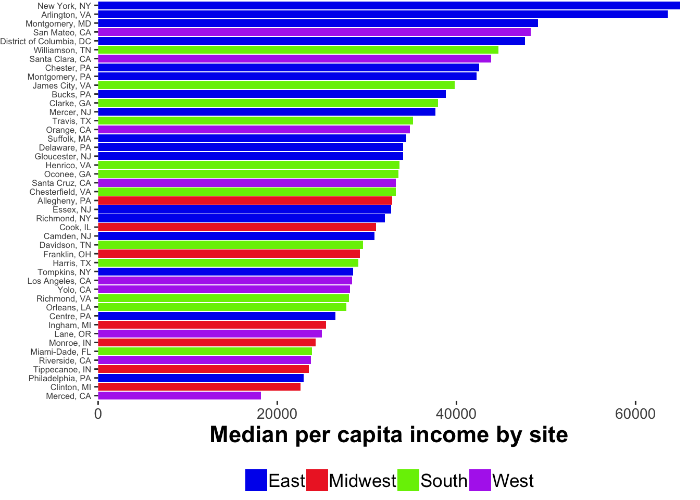
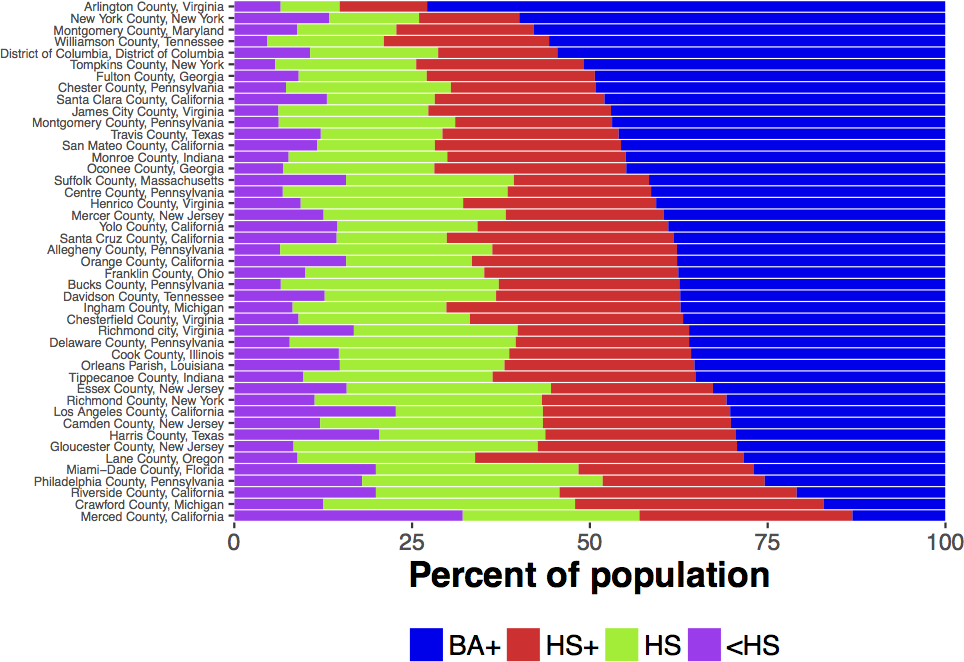

```{r setup, include=FALSE}
knitr::opts_chunk$set(echo = TRUE)
```


PLAY will produce a widely varied and rich set of data, most of which will be openly shared with the research community at the end of the five-year NIH grant period in late 2023.

# Collection sites {.tabset}

Data will come from 30 geographically diverse sites across the US representing rural, suburban, and urban communities with different races, ethnicities, and socio-economic status, including English- and Spanish-speaking households.
The aim is to collect data that approximate county-level demographic characteristics as reflected in U.S. Census data.

## Map


## Racial composition


## Socio-economic status



## Education



## Languages spoken


# Video

All data collections will be recorded on video.
Parents will be asked for their permission to share the video recordings and other data with the research community.
When that permission is granted the videos and related data will be shared with the research community via [Databrary](http://databrary.org):

- Adolph, K., Tamis-LeMonda, C., Gilmore, R.O. & Soska, K. (2016). PLAY Project: NICHD Workshop (2016-12-16). Databrary. Retrieved August 23, 2018 from http://doi.org/10.17910/B7.254.
- Adolph, K., Tamis-LeMonda, C. & Gilmore, R.O. (2017). PLAY Project: Pilot Data Collections. Databrary. Retrieved August 23, 2018 from https://nyu.databrary.org/volume/444.
- Adolph, K., Tamis-LeMonda, C., Gilmore, R.O. & Soska, K. (2018). Play & Learning Across a Year (PLAY) Project Summit (2018-06-29 Philadelphia). Databrary. Retrieved August 23, 2018 from http://doi.org/10.17910/B7.724

# Parent-report (questionnaire) data

PLAY researchers will collect and share a substantial corpus of parent-report (questionnaire) data.

The full set of self-report questions can be found [here](questionnaires.html).
A database/code book of the questionnaire items useful for item-level queries can be found in a Googlesheet [here](https://docs.google.com/spreadsheets/d/1pVOM2naRS_STCXx4nkaRDLO6_V5kGhFaduRfwsv7cnI/edit?usp=sharing).
The [`googlesheets`](https://github.com/jennybc/googlesheets) R package makes it easy to interact with data in this format.
We expect to migrate to successors to this package.
