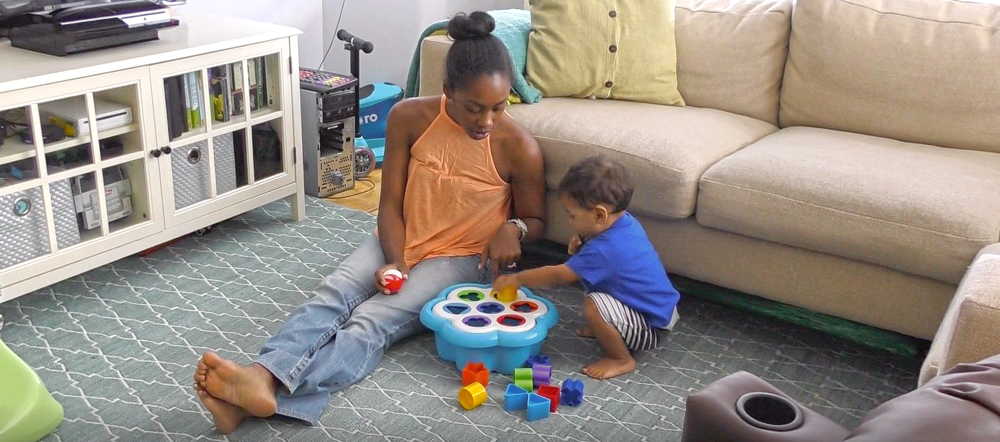

{width=300}

{width=600}

# The Play & Learning Across a Year (PLAY) project 
The PLAY project is a collaborative research initiative by 70+ researchers from 50+ universities across the United States and Canada. It serves as a model system for doing development science from a “big data” approach. Natural free play represents the foundation of infant learning, but we know little about how infants play, how play unfolds in real time and across development, and how individual and group differences promote infant learning and development through play.

PLAY focuses on recording and revealing the behaviors of infants and mothers during natural activity in their homes, providing an unprecedented corpus of data, and using an innovative, transparent approach to science. The data set will consist of fully transcribed and annotated videos, parent report questionnaires, video tours of the home, digital recordings of ambient noise, and detailed demographic information on 900+ infants and mothers from across the United States. This first-of-its-kind corpus will be shareable and searchable with data spanning domains from language to locomotion, gender to gesture, and object play to emotion.

The aim of the project is to develop a new approach to developmental science that enables: (1) “big data“ science for researchers who would not otherwise have access; (2) a communal, low-cost means of collecting and coding data that retains the autonomy of individual labs; and (3) a plan for leveraging diverse expertise to address a common goal. 

## Support
PLAY is supported by grants from the Office of the Director, National Institutes of Health, (OD), Eunice Kennedy Shriver National Institute for Child Health and Human Development (NICHD), the National Institute of Mental Health (NIMH), and the National Institute on Drug Abuse (NIDA) under R01HD094830-01, the LEGO Foundation, and the Alfred P. Sloan Foundation.

## Website info
```{r child = 'website-info.Rmd'}
```
