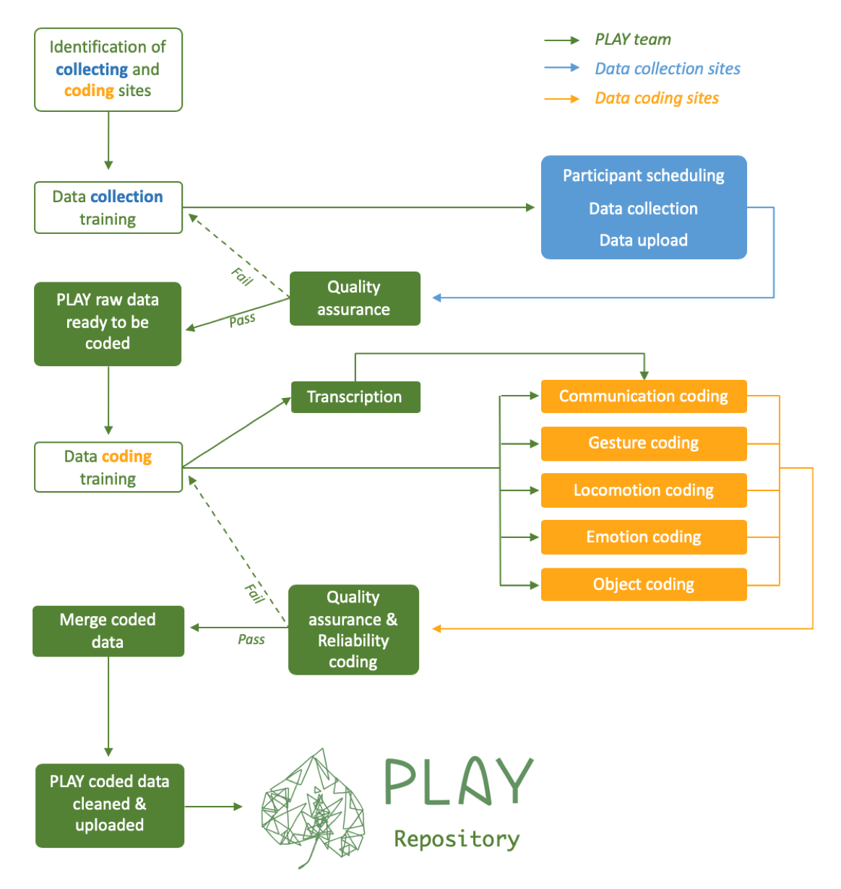
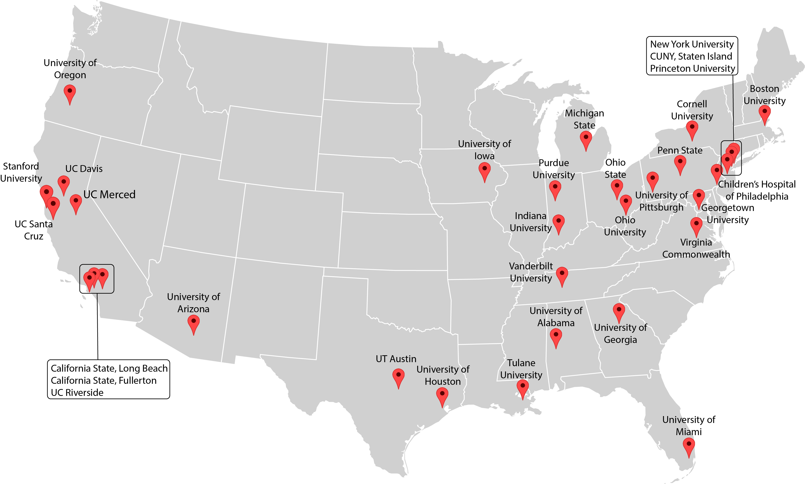

 

# Overview of PLAY data

To answer questions about infant behaviours in their natural environments, the PLAY project will collect, code, and share 900 hours of video collected in the homes of children at 12, 18, and 24 months of age drawn from 30 sites across North America.  

PLAY aims to set new standards for conducting open, transparent, and reproducible behavioral science by i) publishing the protocol, and ii) making extensive use of video exemplars to demonstrate phenomena and illustrate behavioral codes. For confidentiality reasons, access to video exemplars is restricted to researchers with authorized access to [Databrary](http://databrary.org). To register for access, visit <http://databrary.org/register>.

Materials (videos, questionnaires, links to Databrary volumes) for the PLAY project are included in this site, where we document data collection protocols, workflows, coding strategies, and operational definitions. Please ensure that you are  [**currently logged in at Databrary**](https://nyu.databrary.org/user/login) to view embedded video examples in this webpage and gain access to phone and home questionnaires.  

## PLAY Project workflow

Below is the project-wide workflow. The PLAY team will provide training, quality assurance, transcription, reliability coding, and collating data for the final PLAY database. The collaborating sites will perform data collection and various levels of data coding.
 
 

 
<h4> &nbsp;&nbsp; <u>Direct Links</u> </h3>
 
  
  
  
  
  
  
  
  
  

 
 

## Video Data

All data collections will be recorded on video.
Parents will be asked for their permission to share the video recordings and other data with the research community.
When that permission is granted the videos and related data will be shared with the research community via [Databrary](http://databrary.org):

- Adolph, K., Tamis-LeMonda, C., Gilmore, R.O. & Soska, K. (2016). PLAY Project: NICHD Workshop (2016-12-16). Databrary. http://doi.org/10.17910/B7.254.
- Adolph, K., Tamis-LeMonda, C., Gilmore, R.O. & Soska, K. (2018). Play & Learning Across a Year (PLAY) Project Summit (2018-06-29 Philadelphia). Databrary. http://doi.org/10.17910/B7.724
- Adolph, K., Tamis-LeMonda, C., Gilmore, R.O. & Soska, K. (2019). Play and Learning Across a Year (PLAY) Project - Protocols & Documentation. Databrary. http://doi.org/10.17910/b7.876. 

#### Full PLAY home visit - example

Videos of a full PLAY home visit protocol are available publicly on the PLAY protocol [Databrary Volume](https://nyu.databrary.org/volume/876) . 

  
  <button size="xs" type="button" data-toggle="collapse" data-target="#fullvideohomevisit">
Full-length video of home visit
  </button>

  <video width="100%" controls="" preload="none">
    <source src="https://nyu.databrary.org/slot/55651/0,7820438/asset/337402/download?inline=true" type="video/mp4"> Your browser does not support html5 video.
  </video>

  
  <button size="xs" type="button" data-toggle="collapse" data-target="#onehournaturalplay">
One-hour natural play
  </button>

  <video width="100%" controls="" preload="none">
    <source src="https://nyu.databrary.org/slot/55651/7821438,11460201/asset/337405/download?inline=true" type="video/mp4"> Your browser does not support html5 video.
  </video>

  
  <button size="xs" type="button" data-toggle="collapse" data-target="#housewalkthrough">
House walkthrough
  </button>

  <video width="100%" controls="" preload="none">
    <source src="https://nyu.databrary.org/slot/55651/11461201,12477351/asset/337415/download?inline=true" type="video/mp4"> Your browser does not support html5 video.
  </video>

  
  <button size="xs" type="button" data-toggle="collapse" data-target="#structuredplay">
Five-minute structured play
  </button>

  <video width="100%" controls="" preload="none">
    <source src="https://nyu.databrary.org/slot/55651/12478351,12812325/asset/337416/download?inline=true" type="video/mp4"> Your browser does not support html5 video.
  </video>

  
  <button size="xs" type="button" data-toggle="collapse" data-target="#questionnaires">
Parent-report questionnaires
  </button>

  <video width="100%" controls="" preload="none">
    <source src="https://nyu.databrary.org/slot/55651/12813325,14619256/asset/337417/download?inline=true" type="video/mp4"> Your browser does not support html5 video.
  </video>

## Parent-report (questionnaire) data

PLAY researchers will collect and share a substantial corpus of parent-report (questionnaire) data. The full set of self-report questions can be found [here](collection_homevisit_questionnaires.html).

 

# Participant sampling
The collaborating sites in PLAY perform a variety of roles (see [people](people.html) for details). Each site that performs a **collecting** role is pre-assigned to complete all of the collecting functions (see in blue below). This page contains detailed help for the recruitment of participants. Click here for information about the <a href="collection.html"><b> data collection </b></a> and <a href="collection.html#clean_up_and_upload"><b> data upload </b></a> processes.

PLAY will produce a widely varied and rich set of data, most of which will be openly shared with the research community at the end of the NIH grant period. Infants' natural play in the home is characterized by tremendous variability including variations in: geographic location, climate, SES, maternal/paternal employment, childcare experiences, infants’ and mothers’ ages, language environment, physical layout and characteristics of the home, availability of media, toys for play, and so on. Researchers will be able to explore the effects of any/all such factors.  

## Inclusion/exclusion criteria

Although PLAY endeavors to sample as much of the rich variations that the collection sites present. Based on conversations with the launch group, and to ensure a sufficient sample size, we will limit variability along several dimensions. To be included in the PLAY sample of 900 sessions, participants must: 

- be 12, 18, or 24 months of age (+/- 1 month)
- come from English or Spanish monolingual or bilingual homes (i.e., no other language exposure in the home)
- be born full-term (at last 36 weeks), of normal birth weight (>= 5.5 lbs), without known disabilities
- be born to parents 18+ years of age (at the time of target child's birth)

The mother must act as the caregiver during the one-hour natural interaction, which will be scheduled at a time when _only_ the mother and target child are present (i.e., no siblings or other caregivers are around). Only one experimenter should be present in the home during the 1-hour natural interaction.

## Collection sites {.tabset}

Data will come from 30 geographically diverse sites across the US representing rural, suburban, and urban communities with different races, ethnicities, and socio-economic status, including English- and Spanish-speaking households.  

The aim is to collect data that approximate county-level demographic characteristics as reflected in U.S. Census data.

### Map

### Racial composition

### Socio-economic status

### Education

### Languages spoken

