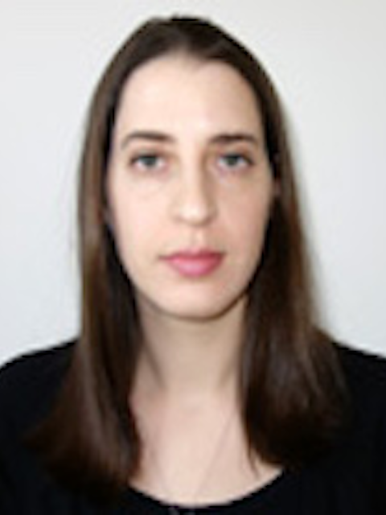

<style>
.row:after { content: ""; display: table; clear: both; }
.column-left{
  float: left;
  width: 40%;
  text-align: left;
}
.column-right{
  float: right;
  width: 60%;
  text-align: left;
}
</style>


## Principal Investigators


<table>
<tr>
<td><br><br><br></td>
<td style="padding:10px">
**Karen E. Adolph, Ph.D**.</br>
New York University</br>
Principal Investigator
</td>
</tr>

<tr>
<td><br><br><br></td>
<td style="padding:10px">
**Catherine Tamis-LeMonda, Ph.D.**</br>
New York University</br>
Co-Principal Investigator
</td>
</tr>

<tr>
<td><br><br><br></td>
<td style="padding:10px">
**Rick O. Gilmore, Ph.D.**</br>
The Pennsylvania State University</br>
Co-Principal Investigator
</td>
</tr>
</table>


## Staff

<div class="row">
<div class="column-left">
</br>
**Kasey Soska, Ph.D.**</br>
Scientific Director
</div>
<div class="column-right">
</br>
**Swapnaa Jayaraman, Ph.D.**</br>
Research Scientist
</div>
</div>
<br>
<br>
<div class="row">
<div class="column-left">
</br>
**Orit Herzberg-Keller, Ph.D.**</br>
Research Scientist
</div>
<div class="column-right">
</br>
**Melody Xu, B.S.**</br>
Program Coordinator
</div>
</div>
<br><br>


## Collaborating Investigators


<!-- Tabling this cool script for now, in favor of new name assignments
```{r, echo=FALSE, message=FALSE, warning=FALSE}
library(tidyverse)
roster_df <- readr::read_csv("csv/roster.csv")
roster <- roster_df %>%
  dplyr::select(., Last, First, Institution, Collection_role) %>%
  dplyr::arrange(., Last)
knitr::kable(roster)
```
-->
<!-- Used this website to create table in markdown: https://thisdavej.com/copy-table-in-excel-and-paste-as-a-markdown-table/-->

| Full name               | Institution                                | Location            | Role                |
|-------------------------|--------------------------------------------|---------------------|---------------------|
| Karen Adolph            | New York University                        | New York, NY        | Collecting & Coding |
| Rebecca Brooker         | Texas A&M                                  | College Station, TX | Coding              |
| Kristin Buss            | Penn State University                      | State College, PA   | Coding              |
| Elizabeth Davis         | University of California at Riverside      | Riverside, CA       | Coding              |
| Kaya de Barbaro         | University of Texas at Austin              | Austin, TX          | Coding              |
| Janet Frick             | University of Georgia                      | Athens, GA          | Collecting & Coding |
| Amie Hane               | Williams College                           | Williamstown, MA    | Coding              |
| Heather Henderson       | University of Waterloo                     | Waterloo, ON        | Coding              |
| Vanessa LoBue           | Rutgers University                         | Newark, NY          | Collecting & Coding |
| Dan Messinger           | University of Miami                        | Miami, FL           | Collecting & Coding |
| Koraly Perez-Edgar      | Penn State University                      | State College, PA   | Coding              |
| Lulu Song               | Brooklyn College                           | Brooklyn, NY        | Coding              |
| Eric Walle              | University of California at Merced         | Merced, CA          | Collecting & Coding |
| Marianella Casasola     | Cornell University                         | Ithaca, NY          | Collecting & Coding |
| Caitlin Fausey          | University of Oregon                       | Eugene, OR          | Collecting & Coding |
| Mike Frank              | Stanford University                        | Palo Alto, CA       | Collecting & Coding |
| Susan Goldin-Meadow     | University of Chicago                      | Chicago, IL         | Coding              |
| Jana Iverson            | University of Pittsburgh                   | Pittsburgh, PA      | Collecting & Coding |
| Casey Lew-Williams      | Princeton University                       | Princeton, NJ       | Collecting & Coding |
| Letitia Naigles         | University of Connecticut                  | Storrs, CT          | Coding              |
| Meredith Rowe           | Harvard University                         | Cambridge, MA       | Coding              |
| Catherine Tamis-LeMonda | New York University                        | New York, NY        | Coding              |
| Anne Warlaumont         | University of California at Los Angeles    | Los Angeles, CA     | Coding              |
| Hanako Yoshida          | University of Houston                      | Houston, TX         | Collecting & Coding |
| Chen Yu                 | Indiana University                         | Bloomington, IN     | Collecting & Coding |
| Dan Yurovsky            | University of Chicago                      | Chicago, IL         | Collecting & Coding |
| Rachel Barr             | Georgetown University                      | Washington, DC      | Collecting & Coding |
| Jean-Paul Boudreau      | Mount Allison University                   | Sackville, NB       | Coding              |
| Amanda Brandone         | Lehigh University                          | Lehigh, PA          | Coding              |
| Lana Karasik            | CUNY -- College of Staten Island           | Staten Island, NY   | Collecting & Coding |
| Cristine Legare         | University of Texas at Austin              | Austin, TX          | Collecting & Coding |
| Klaus Libertus          | University of Pittsburgh                   | Pittsburgh, PA      | Coding              |
| Jeff Lockman            | Tulane University                          | New Orleans, LA     | Collecting & Coding |
| Amy Needham             | Vanderbilt University                      | Nashville, TN       | Collecting & Coding |
| Lisa Oakes              | University of California at Davis          | Davis, CA           | Collecting & Coding |
| Adam Sheya              | University of Connecticut                  | Storrs, CT          | Coding              |
| Peter Vishton           | College of William & Mary                  | Williamsburg, VA    | Collecting & Coding |
| Su-hua Wang             | University of California at Santa Cruz     | Santa Cruz, CA      | Collecting & Coding |
| Laura Claxton           | Purdue University                          | W. Lafayette, IN    | Collecting & Coding |
| Stacey Dusing           | Virginia Commonwealth University           | Richmond, VA        | Collecting & Coding |
| John Franchak           | University of California at Riverside      | Riverside, CA       | Collecting & Coding |
| Simone Gill             | Boston University                          | Boston, MA          | Collecting & Coding |
| Rick Gilmore            | Penn State University                      | State College, PA   | Collecting & Coding |
| Jeff Haddad             | Purdue University                          | W. Lafayette, IN    | Coding              |
| Janet Hauck             | Michigan State University                  | East Lansing, MI    | Coding              |
| Jill Heathcock          | Ohio State University                      | Columbus, OH        | Collecting & Coding |
| Do Kyeong Lee           | California State University at Fullerton   | Fullerton, CA       | Collecting & Coding |
| Mei-Hua Lee             | Michigan State University                  | East Lansing, MI    | Collecting & Coding |
| Laura Prosser           | Children's Hospital of Philadelphia        | Philadelphia, PA    | Collecting & Coding |
| Mark Schmuckler         | University of Toronto Scarborough          | Toronto, ON         | Coding              |
| Sheri Berenbaum         | Penn State University                      | State College, PA   | Contributor         |
| May Ling Halim          | California State University at Long Beach  | Long Beach, CA      | Collecting          |
| Kristina Olson          | University of Washington                   | Seattle, WA         | Contributor         |
| Eva Pomerantz           | University of Illinois at Urbana-Champagne | Champaign, IL       | Contributor         |
| Dima Amso               | Brown University                           | Providence, RI      | Contributor         |
| Bob Bradley             | Arizona State University                   | Tempe, AZ           | Contributor         |
| Guangqing Chi           | Penn State University                      | State College, PA   | Contributor         |
| Gary Evans              | Cornell University                         | Ithaca, NY          | Contributor         |
| Mike Goldstein          | Cornell University                         | Ithaca, NY          | Contributor         |
| Brian MacWhinney        | Carnegie Mellon University                 | Pittsburgh, PA      | Contributor         |
| Laura Namy              | Society for Research In Child Development  | Washington, DC      | Contributor         |
| Melanie Soderstrom      | University of Manitoba                     | Winnipeg, MB        | Contributor         |
| Marc Bornstein          | NICHD                                      | Bethesda, MD        | Contributor         |
| Kathy Hirsh-Pasek       | Temple University                          | Philadelphia, PA    | Contributor         |
| Nora Newcombe           | Temple University                          | Philadelphia, PA    | Contributor         |


## Advisory Board

Coming soon!

