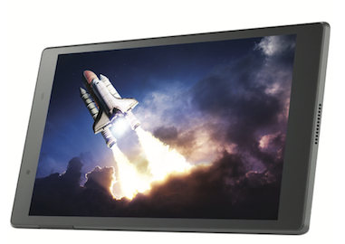
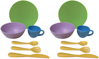

```{r setup, include=FALSE}
knitr::opts_chunk$set(echo = FALSE)
source("R/write_video_clip_html.R")
```


# Participants overview

The collaborating sites in PLAY perform a variety of roles (see [people](people.html) for details). Each site that performs a **collecting** role is pre-assigned to complete all of the collecting functions (see in blue below). This page contains detailed help for the recruitment of participants. Click here for information about the <a href="collection.html"><font color="#5B9BD5"><b> data collection </b></font></a> and <a href="collection.html#clean_up_and_upload"><font color="#5B9BD5"><b> data upload </b></font></a> processes.


PLAY aims to set new standards for conducting open, transparent, and reproducible behavioral science by i) publishing the protocol, and ii) making extensive use of video exemplars to demonstrate phenomena and illustrate behavioral codes. For confidentiality reasons, access to video exemplars is restricted to researchers with authorized access to [Databrary](http://databrary.org). To register for access, visit <http://databrary.org/register>.

Please ensure that you are  [**currently logged in at Databrary**](https://nyu.databrary.org/user/login) to view embedded video examples in this webpage and gain access to phone and home questionnaires.

# Participant Sampling

PLAY will produce a widely varied and rich set of data, most of which will be openly shared with the research community at the end of the five-year NIH grant period in late 2023. Infants' natural play in the home is characterized by tremendous variability including variations in: geographic location, climate, SES, maternal/paternal employment, childcare experiences, infants’ and mothers’ ages, language environment, physical layout and characteristics of the home, availability of media, toys for play, and so on. Researchers will be able to explore the effects of any/all such factors.  

## Inclusion/Exclusion Criteria

Although PLAY endeavours to sample as much of the rich variations that the collection sites present, based on conversations with the launch group, we will limit variability along several dimensions. To be included in the PLAY sample of 900 sessions, participants must be: 

- from two-parent or single-parent households
- English or Spanish monolingual or bilingual (i.e., no other language exposure in the home)
- the firstborn child (i.e., only child in the household)
- 12, 18, or 24 months of age (+/- 1 week)
- born full-term (37-40 weeks) without known disabilities

Additionally, the mother must act as the caregiver during the one-hour natural interaction, which will be scheduled at a time when _only_ the mother and infant are present.


## Collection sites {.tabset}

Data will come from 30 geographically diverse sites across the US representing rural, suburban, and urban communities with different races, ethnicities, and socio-economic status, including English- and Spanish-speaking households.  

The aim is to collect data that approximate county-level demographic characteristics as reflected in U.S. Census data.


### Map


### Racial composition


### Socio-economic status


### Education


### Languages spoken


## Video

All data collections will be recorded on video.
Parents will be asked for their permission to share the video recordings and other data with the research community.
When that permission is granted the videos and related data will be shared with the research community via [Databrary](http://databrary.org):

- Adolph, K., Tamis-LeMonda, C., Gilmore, R.O. & Soska, K. (2016). PLAY Project: NICHD Workshop (2016-12-16). Databrary. Retrieved August 23, 2018 from http://doi.org/10.17910/B7.254.
- Adolph, K., Tamis-LeMonda, C. & Gilmore, R.O. (2017). PLAY Project: Pilot Data Collections. Databrary. Retrieved August 23, 2018 from https://nyu.databrary.org/volume/444.
- Adolph, K., Tamis-LeMonda, C., Gilmore, R.O. & Soska, K. (2018). Play & Learning Across a Year (PLAY) Project Summit (2018-06-29 Philadelphia). Databrary. Retrieved August 23, 2018 from http://doi.org/10.17910/B7.724

## Parent-report (questionnaire) data

PLAY researchers will collect and share a substantial corpus of parent-report (questionnaire) data.

The full set of self-report questions can be found [here](questionnaires.html).
A database/code book of the questionnaire items useful for item-level queries can be found in a Googlesheet [here](https://docs.google.com/spreadsheets/d/1pVOM2naRS_STCXx4nkaRDLO6_V5kGhFaduRfwsv7cnI/edit?usp=sharing).
The [`googlesheets`](https://github.com/jennybc/googlesheets) R package makes it easy to interact with data in this format.
We expect to migrate to successors to this package.  

<br><br>

# Participant Recruitment


## 1. Scheduling Visit

*To schedule a visit, you will be making two phone calls to each family: the initial recruiting call and the confirmation call (if the family agrees to participate). Depending on the availability of the mother, you will complete the [participant paperwork](link to questionnaires)*

### 1.1 Initial recruiting call

<!--
</br>
<video width="320" height="240" controls>
  <source src="https://nyu.databrary.org/slot/14765/0,79273/asset/64898/download?inline=true" type="video/mp4">
Your browser does not support the video tag.
</video>
</br>
-->

<!-- This is the code from the wiki - for now, the button doesn't seem to be collapsed-->
<button size="xs" type="info" collapse="initialschedule">Video</button>
<collapse id="initialschedule" collapsed="true">
<grid>
<col xs="12" sm="6" lg="6">
<panel type="info">
<html>
<video width="100%" controls preload="none">
<source src="https://nyu.databrary.org/slot/14765/0,79273/asset/64898/download?inline=true" type="video/mp4">
Your browser does not support html5 video.
</video>
</html>
</panel>
</col>
</grid>
</collapse>


Hi, may I speak with [MOM]?

My name is [CALLER NAME] and I’m calling from [LAB] about a home study where we're looking at how moms and babies interact with each other. We'd be visitng your home and you'd receive $25 at the end of the visit for your participation. Can we tell you about it?

First, I have some questions to see if you and [CHILD] qualify for the study. 

Does [CHILD]have any siblings?

- → *If yes: **end call**.* In this study, we are currently looking for only-children. Would it be alright if we contacted you for other studies in the future?
- → *If no: continue*

What language(s) do you speak to [CHILD]?

- → *If not ENGLISH or SPANISH: **end call**.* To control for differences in communication, we are looking for families who speak mainly English or Spanish. Would it be alright if we contacted you for other studies in the future?
- → *If yes: continue*

Was [CHILD] born on his/her due date? (If not: “How many weeks and days early/late was he/she?”)

- → *If more than 4 weeks early: end call.* In this study, we are currently looking for children born on term. Would it be alright if we contacted you for other studies in the future?
- → *If born on term (37-41 weeks): continue*

For this study, we are interested in learning about babies’ natural, everyday experiences in their homes. A researcher will visit you and [CHILD] in your home for about 2.5 hours. You and [CHILD] will be video recorded for 1 hour as you go about your day, followed by questions on [CHILD]'s skills and routines. We will ask you to take us through your home as we record the environment. For your participation, we will compensate you with $25 at the end of the session.

The data collected in this study are valuable and will be placed in a secure web-based library available only to researchers. The purpose is to share the data with experts in the field so that scientists can learn more about infant development.

Does this sound like something you would be interested in participating in with [CHILD]?

→ *If no to study or to sharing video on Databrary:* Okay, thank you. May we call you for other studies?

→ *If yes:* Great! Because we are interested in mother-infant routines, we'd like to find a time and date when we can observe just <span style="text-decoration:underline">**you and [CHILD]**</span> at home. It would be great if we can schedule a time that is not during a typical mealtime and when [CHILD] is usually awake. Is there a convenient time and day that works best for you that would be within these criteria?

→ *If the date they are available puts baby out of age range:* For this study, we are interested in studying specific age groups: 12-, 18-, and 23-month olds. Would it be possible for us to contact you in XX months to see if [CHILD] can participate then?

---

- Before the study, we have a few questions that we'd like to ask. It should only take about 5 minutes. We can either ask you now or when we call to confirm the study. What would you prefer?

→ *If yes:* 

Just as a reminder, the data we collect from you now and during the visit, will be shared on a web-based library only available to researchers like the professor who runs this lab. 

- On your tablet, open Kobo toolbox and start a new questionnaire set
- Fill out participant information at top of new session
- “Save as Draft” after Phone Questionnaire and home visit questionnaires
- Only hit “Submit” after filling out clean-up notes back in lab

[List of questions on the Phone Questionnaire](https://nyu.databrary.org/volume/254/slot/15048/-/asset/63741)
*Please note that presentation and format will differ in the app.*

→ *If no:* Proceed with wrapping up the call:

---

- So I have you and [CHILD] for our study on [DATE] at [TIME]. We'll be calling you the day before (if study is on Monday: the Friday before) your appointment to confirm that that time still works for you. Have a great day!
- If the date they are available puts baby out of age range: For this study, we are interested in studying specific age groups: 12-, 18-, and 23-month olds. Would it be possible for us to contact you in XX months to see if [CHILD] can participate then? → If no to study or to sharing video on Databrary: Okay, thank you. May we call you for other studies?

→ If no: Okay, thank you. May we call you for other studies?   


#### Voicemail

Hi, this message is for [MOM]. My name is [NAME] and I’m calling from [LAB]. I’m calling because we have a fun study for [12 / 18 / 24]-month-olds and [CHILD] is the perfect age. You would receive $25 for participating in the study and if you are interested in hearing more, please give us a call back. Our phone number is [XXX-XXX-XXXX]. Thank you and we hope to hear from you soon! 

### 1.2 Confirming the visit (1 day before actual visit, also email the day before)

<insert 4 videos here>

Hi, may I speak with [MOM]?

My name is [NAME] and I’m calling from [LAB] to confirm our visit with you and [CHILD] on [DATE]. Does this time and date still work for you?

→ *If yes:* 

---

→ *If phone questionnaire was not completed during initial phone call:* Before the visit, I’d like to ask you a few questions. It will only take 5 minutes of your time. Can we speak now?

→ *If yes:* 

Just as a reminder, the data we collect from you now and during the visit, will be shared on a web-based library only available to researchers like the professor who runs this lab. 

- On your tablet, open Kobo toolbox and start a new questionnaire set
- Fill out participant information at top of new session
- “Save as Draft” after Phone Questionnaire and home visit questionnaires
- Only hit “Submit” after filling out clean-up notes back in lab

[List of questions on the Phone Questionnaire](https://nyu.databrary.org/volume/254/slot/15048/-/asset/63741)
*Please note that presentation and format will differ in the app.*

→ *If no:* Can I call you back today or tomorrow [before the visit]. *Schedule call.* 

---

## 2. Preparing for Visit

### 2.1 Pack

<div>
<table width="70%">
<tr>
<td width="25%"> Camera, SD card and extra battery </td>
<td width="25%" style="padding-right: 40px;">  </td>
<td width="25%"> Microphone with sponge cover  </td>
<td width="25%">  </td>
</tr>
<tr>
<td width="25%"> Fully loaded and charged tablet</td>
<td width="25%">  </td>
<td width="25%"> Laser Measure  </td>
<td width="25%" style="padding-right: 40px;">  </td>
</tr>
<tr>
<td width="25%"> Decibel meter mic  </td>
<td width="25%" style="padding-right: 40px;">  </td>
<td width="25%"> Tripod for camera</td>
<td width="25%">  </td>
</tr>
<tr>
<td width="25%"> Tote bag  </td>
<td width="25%">  </td>
<td width="25%"> Yoga mat </td>
<td width="25%" style="padding-right: 40px;">  </td>
</tr>
<tr>
<td width="25%"> Dish set  </td>
<td width="25%">  </td>
<td width="25%"> Toy </td>
<td width="25%" style="padding-right: 40px;">  </td>
</tr>
<tr>
<td width="25%"> Participant payment  </td>
<td width="25%" style="padding-right: 40px;">  </td>
<td width="25%"> Paper backups of all questionnaires and forms </td>
<td width="25%">  </td>
</tr>
</table>
</div>

<!--
- Camera, SD card and extra battery 
- Mic 
- Laser Measure 
- Dish set, doll, and tote bag 
- Yoga mat 
- Tablet with app for questionnaires, study consent form, Databrary sharing release form, and decibel meter mic 
- Participant payment 
- Paper copies of all questionnaires, MCDI, and consent and Databrary forms in case of tablet failure
-->


